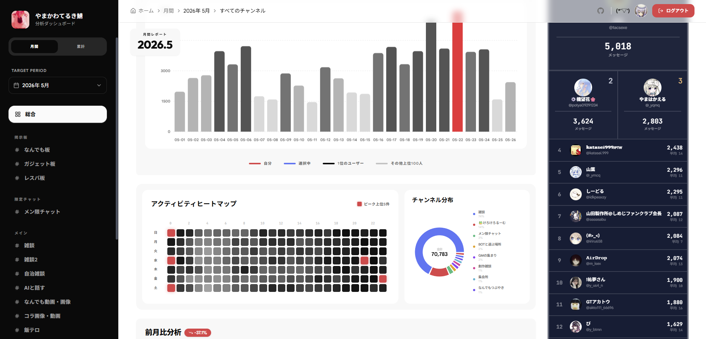

<div align="center">
<h1>
  Discord Server Web Analytics
  
  [](https://discordpy.readthedocs.io/)
  [](https://www.python.org/downloads/release/python-3100/)
  [](https://fastapi.tiangolo.com/)
  [](https://astro.build/)
  [](https://www.postgresql.org/)
  [](LICENSE)
</h1>
Discord鯖のアクティビティ収集、集計、可視化するための統合システムです。<br>
Discord.pyによるデータ収集、FastAPIによるデータ提供、Astro/ReactによるWebダッシュボードで構成<br>
<br>


<br>
<sub>Webダッシュボード</sub>
</div>
<br/>

## なんのためにつくった...?

Discordの今までのチャット履歴等を全て取得し、視覚化するため！！
もとは月の発言ランキングの集計のために使っていたものを改造したものです。
公開Botとかにする予定は今のところないので(db死ぬので)、使いたい人はライセンスの下改造してね！！

## 機能など...

### データ収集

- Botはメッセージの送信日時、文字数、チャンネルのみを保存します。※メッセージ本文は保存しません。
- 削除されたユーザー（Deleted User）やBotが認識できないユーザーは、ランキングおよび個人推移グラフから自動的に除外されます。

### Webダッシュボード

- サーバー全体の活動量、ヒートマップ、チャンネル別分布を表示。
- ユーザーごとの発言数推移を折れ線グラフで可視化。
- ログイン中のユーザーおよび検索したユーザーのデータをグラフ上で比較可能。

## ディレクトリ構成

```
- bot/ : データ収集およびコマンド操作を行うDiscordBot
- backend/ : データベースと通信し、フロントエンドにJSONを提供するRESTAPI
- frontend/ : Webダッシュボード (Astro + React)
```

## ライセンス

[AGPL-3.0](LICENSE)  
改変した後、ネットワーク経由でユーザーにサービスを提供する場合、ソースコードの公開義務が発生します。

---
© 2026 ymkw.top
